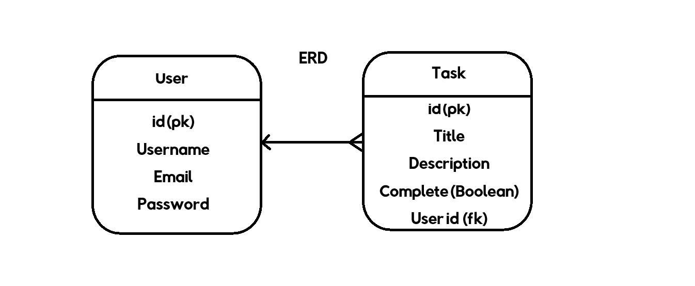

# To Do or Not To Do

### Deployed Link
https://againagain-a184e9f92a54.herokuapp.com/login/?next=/

## Project description

A simple to do application for users to record tasks. They can create, edit, delete and search for tasks that need completing. They have the ability to log in or out and only see their own lists and no one elses. 

### User demographics

This application can be used by anyone who registers on the site. It's simple design makes it easy for users to understand functionality.

# Planning

## User Interface Design (UI)

### Inspiration

I wanted to do a simple to do list as I find them very useful in my own life. For example I like to keep reference numbers for billing companies or make lists if it's a birthday or Christmas. The way I have set it out means I can make a list for a certain individual and then list items in the description. Once these items have been purchased I can have a visual representation of whether it is complete or not.

I wanted to make is so simple that there was no reason to complicate the application with instructions, as in my experience no one reads them or if they do they can be confusing for the user. 

I also did not want to use pictures or fancy graphics as this can be distract from the overall functionality of the application. 

### Wireframes

I knew very early on how I wanted the application to look. It was literally a box with the information contained within it. I wanted to make it a simple colour as to not distract the user and for the Django built in functions to do a lot of the donkey work for me. 

### Brand Identity

Orange is my favourite colour and I thought it looked pleasing to the eye and lighter peach colour in the container helped with contrast and readability. I decided to stick with a simple font (lexend) to compliment my basic design. 

### Interaction Design

The application has limited interaction by design. It is a simple to use website and there was very little need for interaction beyond the basics. 

### Accessibility

The application was tried and tested for full functionality and due to the simplistic design there were very few accessability issues with the application.

## User Experience (UX)

### Database Planning

I began my database design by sketching out my models and an entity relationship diagram. Because of my previous experience in SQL, I began by following the principles of MySQL and used integer, varchar, and set. This helped me understand what I was going to create in the backend of this site.

### The Purpose and Target Audience

My target audience is everyone that wishes to make a to do list. They are very useful and I find the ones built into phones etc are finicky to use and not user friendly.

### User stories

| User Story                                                                                                                           | MoSCoW Prioritisation |
| :----------------------------------------------------------------------------------------------------------------------------------- | :-------------------: |
| As a user I want to sign up for an account so that I can access the project management features.                                     |       Must Have       |
| As a user I want to log in to my account so that I can view and manage my projects.                                                  |       Must Have       |
| As a user I want to log our of my account to ensure my information remains secure.                                                   |       Must Have       |
| As a team member I want to create a new project so that I can start organising tasks and collaborating with others.                  |       Must Have       |
| As a project manager I want to add team members to a project so that they can contribute and view project details.                   |      Could Have       |
| As a team member I want to create tasks on a Kanban board so that I can visualise and manage the workflow.                           |      Won't Have       |
| As a user I want to drag and drop tasks between columns on the Kanban board so that I can update their status easily.                |      Won't Have       |
| As a team member I want to create and manage to-do lists within a project so that I can track smaller action items.                  |       Must Have       |
| As a team member I want to upload PDF files to a project so that I can share important documents within the team.                    |      Should Have      |
| As a user I want to comment on tasks so that I can collaborate and communicate with team members.                                    |       Must Have       |
| As a user I want to share links within a project so that team members can access relevant external resources.                        |      Should Have      |
| As a project mananager I want to assign roles and permissions to team members so that I can manage access levels within the project. |      Won't Have       |
| As a user I want to toggle between light and dark modes so that I can adjust the interface to my preference.                         |      Should Have      |
| As a team member I want to recieve notifications for project updates so that I can stay informed of changes and new assignments.     |       Must Have       |
| As a user I want a logo so that I can recognise the site and build trust.                                                            |       Must Have       |
| As a user I want a vertical navbar that is visible on every page.                                                                    |       Must Have       |
| As a user I want clear links on the nav bar so I can go to any page.                                                                 |       Must Have       |
| As a user I want a log in page that is easy to use so that I can log in every time.                                                  |       Must Have       |
| As a user I want a sign up page so that I can sign up for the service easily.                                                        |       Must Have       |
| As a team leader I want roles on the sign up page so that my colleagues can sign up with their permissions.                          |      Should Have      |
| As a user I want my username to be visible on the nav bar to promote familiarity.                                                    |       Must Have       |
| As a user I want to create a project from the projects page so that I can create multiple projects.                                  |      Could Have       |
| As a user I want to be able to name a project and give a brief description.                                                          |      Could Have       |
| As a user I want an add task button so that I can add tasks to my project easily.                                                    |       Must Have       |
| As a user I want an edit task button so that I can edit tasks in my project.                                                         |       Must Have       |
| As a user I want a delete task button so that I can delete tasks in my project.                                                      |       Must Have       |
| As a user I want a backlog column so that I can see all the tasks that need to be done in the future.                                |      Won't Have       |
| As a user I want a to-do column so that I can see what tasks need to be done.                                                        |      Won't Have       |
| As a user I want an in progress column so that I can see what task I am currently doing.                                             |      Won't Have       |
| As a user I want a done column so that I can see what task I have done.                                                              |      Won't Have       |
| As a developer I want to use fonticons for each column for user experience.                                                          |       Must Have       |
| As an admin I want to see how many users I have and what projects they have so that I can organise my team.                          |      Won't Have       |
| As a team leader I want to see what my colleagues are working on within their projects so that I can organise my team.               |      Won't Have       |

### Agile

I took an agile approach to this project, focusing on the user and iterating my work to better create my project.

I started my agile approach by creating my user stories, justifying all choices from the perspective of users and developers. I tried to create users stories from a range of perspectives, not limited to just end users but also developers, team leaders and project managers. Although this proved to be ambitious given the time frame and my own abilities, I felt these perspectives gave me confidence to complete my project.

I used a github projects kanban board to organise my user stories. I used it as a visual guide to my progress throught the project, moving tasks from one column to another based on where I was in my sprints. There were four columns on my board:

1. Backlog: This section housed all of the user stories at the beginning of the project. It was then used for the tasks that would not be completed in this iteration, due to time constraints or my own ability with the technologies. Therefore, the backlog almost became a future features section too.
2. Todo: This column was used for items that hadn't been started but needed to be worked on in one of my upcoming sprints. This section served to help when planning my tasks per day.
3. In Progress: This section was for items currently being worked on. I could keep on task when stories were placed into this column, and had a visual guide as to how far along in my sprint I was. If a task was not completed in a given sprint, it was placed back into the todo column for the next day.
4. Done: This column was for all completed tasks. Tasks only made it to the done column once they had been fully completed. This was a great motivator to see what stories I had already completed.

Each user story had a MoSCoW prioritisation label attached to it. These labels were added in the middle of the project as I felt this helped me understand where I was within the project better. At the beginning I was hopeful (and naive) enough to think that I could fulfill all user stories. But during the project I realised that my MVP was the most important aspect of the project and so used the prioritisation labels to reflect that. This helped me in my planning towards the second half of the project because I focused on only the must have features.

My MVP became a very simple task app rather than a full project management app. I felt that the Kanban board and team organisation aspects were better suited to a future iteration of my project. The site would fulfill the criteria for the project, and work well for users as just a simple to-do list task app.

The biggest aspect of Agile I used in this project was my sprints. I took each day as a seperate sprint to achieve an aspect of my plan. This was only possible because of the daily scrum meetings led by my facilitator, Amy. The scheduled meetings at 9am and 4pm helped keep my sprints contained and the ability to talk about that days work kept me focused. I seldom ran into problems because of our daily meetings and this also helped boost my confidence going into the next days sprints.

Github project board: https://github.com/users/alexcurnow96/projects/6

# Features

### Navbar

I decided to create a sidebar with my navigation links to make better use of the space. I wanted a clean and simple site with very few distractions outside of the basic functionality, so using a portion of the page for the navbar helped to highlight the links throughout the site for the user.
The main features of the navbar are the sites logo and the username of the logged in user. The links to other pages change depending on if the user is logged in or not. An unauthorized user sees Sign Up, Log in, and Task List links, whereas an authorized user sees the Tast List and Log Out links.
This site does not feature a footer. There are instead social media links at the bottom of the sidebar. These link to Facebook, Instagram, and Twitter.

### Buttons or links

There are a number of buttons on the site. The two buttons on the home page link to the Task List page and the Sign Up page. When an unauthorized user clicks on the first they are sent to the Log In page instead because unauthorized users cannot access the Task List.

The Task List page features many buttons. There is one button for adding a task which leads you to the Task Form Page. Every added task then generates three more buttons. These are “view”, “edit”, and “delete”. Each of these buttons has a hoverable popup that tells the user what to do on that page. This is to ensure user flow is seamless and there is reduced confusion.
Every form on the website has a submit button which posts the content back to the server and sends the user to the chosen page.

### Forms

Forms are the main way of inputting information into this site. They provide a user-friendly, easy way to send and get information from the database in the backend of this project. I used Django’s built-in forms as well as creating my own to populate the site.
The forms featured on Task Nest are the Sign Up, Log In, and Log Out pages, as well as the form to create a task, and create a comment. The Task Form is also used on the edit task page.

# Future Features

I would like to be able to embed links into the description so that people can take a website (for example an item they want for Christmas) and it will navigate to that website.

# Bugs

# Manual Testing

| Feature                    | Tested?  | User Input Required | User Feedback Provided     | Pass/Fail | Fix |
|----------------------------|----------|---------------------|----------------------------|-----------|-----|
| Navbar Logo and Icons | Yes | Click | Logo and name takes user to 'Home' page, icons take user to intended location. | Pass | - |
| Navbar color text  | Yes | Hover | Colour changes upon hover | Pass | - |
| Sign Up Page               | Yes      | Username/ Email (optional)/ Password | Empty fields deliver prompt to user, email field demands '@' symbols, password requirements need to be met | Pass | - |
| Sign In | Yes | Username and Password | Username//Password must be exactly as registered originally in either lowercase/uppercase or mixture | Pass | - |
| Home Page Buttons| Yes | Click | First button goes to /tasks and second to Sign Up. If user is not logged in, the first button takes them to the Sign In page. | Pass | - |
| Social Media Buttons | Yes | Click | Each icon takes you to the relevant social media site. | Pass | - |
| Add Task (Registered User) | Yes | Title and (optional) Description field | Task form is displayed. Title, description, and completed checkbox | Pass | - |
| View Task (Registered User) | Yes | Click on view button | Task view page with task title, description, and comment form. | Pass | - |
| Edit Task (Registered User) | Yes | Click on edit button | Task form is displayed to edit the information on the server. Title, description, and completed checkbox | Pass | - |
| Delete Task (Registered User) | Yes | Click on delete button | Confirm delete page is displayed with the option for the user to return to the task list or delete the task. | Pass | - |
| Instruction popups | Yes | Hover on button | Hover over button on task list page to view instructions. | Pass | - |
| Add Comment | Yes | Fill in text field | 'Please fill in this field' if no text is inputted into text field. | Pass | - |
| Delete Comment | Yes | Press delete button | Comment gets deleted, no other feedback provided. | Pass | Add a toast message |

### HTML VALIDATION

I have used HTML W3C Validator (https://validator.w3.org/) to validate all of my HTML files.

Due to my pages being developed with Jinja syntax, owing to Python/Django, I had to change the way I validated my templates. This included:

- Deploying my site to Heroku and navigating to each individual page.
- Right clicking to access the page’s source code.
- Ctrl + A to select all the page’s HTML code from this screen.
- Pasting this code into the direct input on the HTML W3C Validator.

I could then check for any errors and warnings to be able to fix them. If there were any errors that needed to be fixed, I then redeployed to Heroku and followed the steps to revalidate the code.

|           |           |             |
| --------- | :-------: | ----------: |
| Task Form | No errors | No warnings |
| Index     | No errors | No warnings |
| Task List | No errors |   1 warning |
| Task      | No errors | No warnings |
| Delete    | No errors | No warnings |
| Logout    | No errors | No warnings |
| Sign In   | No errors |   1 warning |
| Sign Up   | No errors | No warnings |

### JAVASCRIPT VALIDATION

JSHint (https://jshint.com/) was used to validate the small amount of JavaScript code added to the project. Below are the findings.

### PYTHON VALIDATION

CI Python Linter (https://pep8ci.herokuapp.com/) was used to validate the Python files that were created or edited by myself.

| |admin.py| forms.py| models.py| urls.py |views.py|
| :---:| --- | --- | --- | --- | --- |
|todoapp| No errors| No errors| No errors| No errors| No errors|
|tasknest| n/a| n/a| n/a| No errors| n/a|

### CSS VALIDATION
W3C CSS Validator (https://jigsaw.w3.org/css-validator/) was used to validate my CSS file. No errors were present for my CSS file. Below are the findings.

### LIGHTHOUSE SCORES
Lighthouse testing was carried out in Incognito mode to achieve the best result. Performance was lower than preferred on mobile due to the site being image heavy because of the logo. I changed the format of the logo image to help this score. This report will be reviewed for future developments to raise this score. Desktop and mobile scores are listed below.

### WAVE ACCESSIBILITY EVALUATION

## Deployment steps

The site was deployed to Heroku. The steps to deploy are as follows:
- Install the gunicorn python package and create a file called 'Procfile' in the repo's root directory
- In the Procfile write 'web: gunicorn lunar_lists.wsgi'
- In settings.py add ".herokuapp.com" to the ALLOWED_HOSTS list
- In settings.py add 'https://*.herokuapp.com' to CSRF_TRUSTED_ORIGINS list
- git add, commit and push to github
- Navigate to the Heroku dashboard
- Create a new Heroku app
- Give it a name and select the region 'Europe'
- Navigate to settings tab and scroll down to Config Vars
- Click 'Reveal Config Vars'
- Add the following keys:
    - key = DATABASE_URL | value = (my secret database url)
    - key = SECRET_KEY | value = (my secret key)
- Navigate to Deploy tab
- Connect to GitHub and select the repo 'lunar-lists'
- Scroll down to 'Manual deploy' and select the 'main' branch
- Click 'Deploy Branch'

## Credits

### Tutorials
- Dennis Ivy: Django To Do List App with User Registration & Login.
    - To Do list app with User Registration, Login, Search and full Create Read Update and DELETE functionality. (https://www.youtube.com/watch?v=llbtoQTt4qw)
- Code With Stein: Django Project Management System | Django project with source code
    - Learn how to build a simple project management system from scratch using Django and Tailwind. Plus, you will learn how to deploy this project to a cloud based service called Acorn.(https://www.youtube.com/watch?v=m3nYd_IFZuU&t=33s)
- Code Institute: Learning Management System
    - Developing with Django, Love Running - Essentials Project, Love Rosie - Bootstrap Project (https://learn.codeinstitute.net/dashboard)
- rajeshdn: Side Navigation bar Using HTML and CSS
    - For CSS styling (https://codepen.io/RajRajeshDn/pen/LKzZNe)
- Tyler Potts: Build a Responsive Sidebar in 10 minutes | HTML, CSS & JavaScript
    - Learn how to build a simple and easy responsive animated sidebar in under 10 minutes using HTML, CSS & JavaScript! (https://www.youtube.com/watch?v=neb7WcDixoY)
- amylour: FreeFido_v2
    - A social-community and booking system for a private dog park. Built for Code Institute's Full Stack Software Development Diploma using Django, ElephantSQL and Bootstrap. (https://github.com/amylour/FreeFido_v2)
- MarkChips: lunar-lists
    - Lunar lists allows users to create to-do lists for any task with the addition of a fun and friendly space theme. Whether you are a busy person, or a forgetful one, you can use lunar lists to log all your tasks, set their due date, and mark them as completed when they're done. Your lunar lists are only available to you, so don't worry about people tampering with your lists. (https://github.com/MarkChips/lunar-lists)
### Other
- Google Fonts
- Font Awesome
- Adobe Firefly
- Figma
- Balsamiq
- Fontpair
- Adobe Colour
- Lucid Chart
- Perplexity
- Claude
- Django Documentation
- Amy Richardson's worksheets and files that were made to help us with this project.
- Mark Briscoe's SME sessions
- Martin and Roo MacArthur and John Rearden from the Coding Coach Sessions

## Final Messages
Thank you to my cohort for their support, but most importantly the laughs. Special thanks go to Chris and Helen for answering every message and team huddle whenever I needed them. We got each other through this!

To Amy, you have held me together throughout these sixteen weeks. Thank you for everything you have done for us - especially your messages and calls when I have felt like this course was not for me! I hope the others you help on their journey appreciate you as much as you deserve.

To Mark, I have said it before, and I will say it again - you are THE expert! Thank you for your wisdom and your ability to make us all feel so at ease, even if we are learning some crazy concepts! 

To Martin, John, and Roo. I will never understand how you can so calmly fix all my problems! Thank you for fixing my database issues. I will now never touch my models again!

And finally, to Code Institute... thank you for the opportunity to be taught by such awesome people. And for providing every thing I could need to believe in myself. 