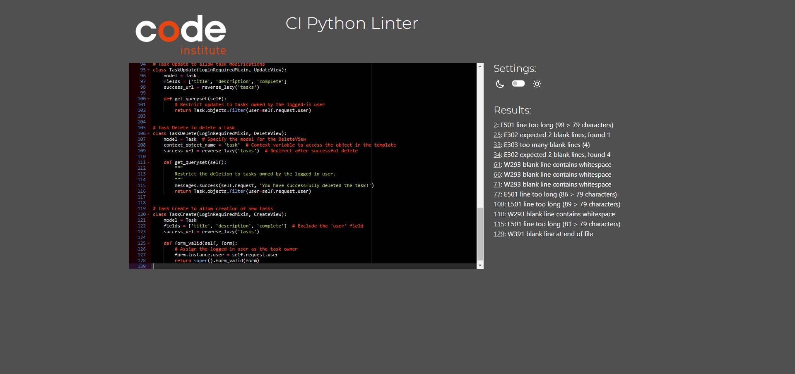
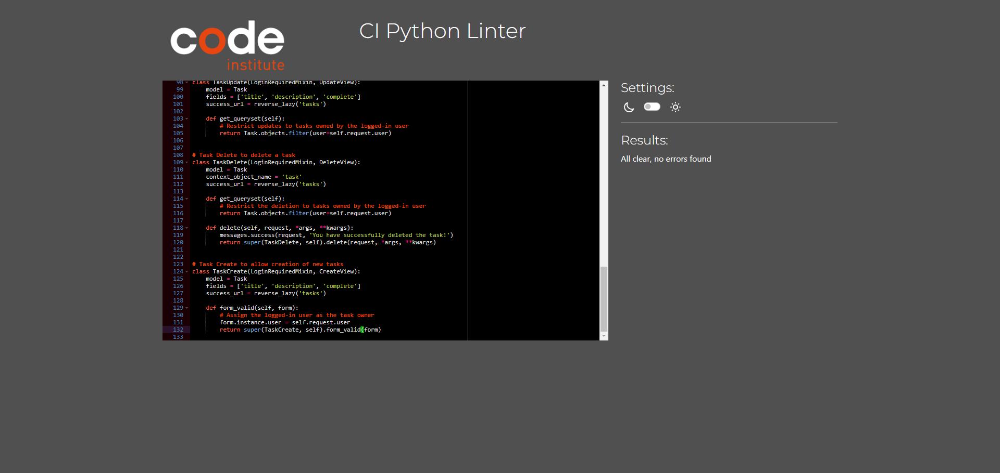
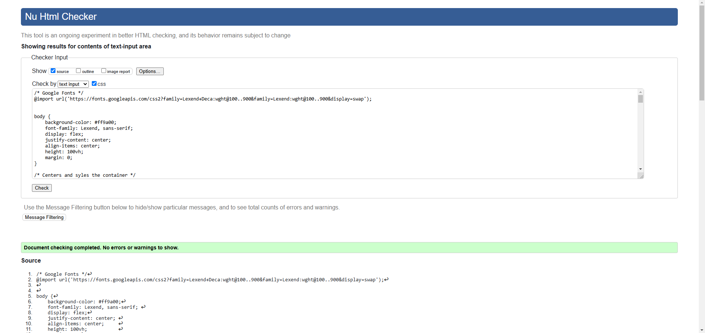
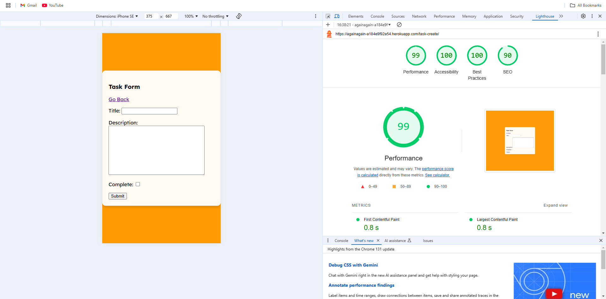

# To Do or Not To Do

### Deployed Link
https://againagain-a184e9f92a54.herokuapp.com/login/?next=/


## Project description

To Do or Not To Do is a simple yet effective task management application that allows users to create, edit, view, and delete their tasks. The app provides a user-friendly interface for individuals who want to organize their to-do lists without unnecessary complexity. Tasks are private to each user and only accessible after logging in.

This project aims to streamline task management for users with busy lifestyles, enabling them to stay on top of their daily responsibilities.

### User demographics

The application targets individuals who require a structured way to manage their daily tasks, such as professionals, students, or anyone looking for a straightforward task management solution. Whether it’s tracking errands, organizing projects, or planning events, the application caters to a wide audience.

## User Interface Design (UI)

The design centers on simplicity and functionality. The interface avoids unnecessary graphics or clutter to ensure a clean and intuitive user experience. For example, users can quickly view their tasks, mark them as complete, or delete them without navigating through complex menus.

### Inspiration

I wanted to do a simple to do list as I find them very useful in my own life. For example I like to keep reference numbers for billing companies or make lists if it's a birthday or Christmas. The way I have set it out means I can make a list for a certain individual and then list items in the description. Once these items have been purchased I can have a visual representation of whether it is complete or not.

I wanted to make is so simple that there was no reason to complicate the application with instructions, as in my experience no one reads them or if they do they can be confusing for the user. 

I also did not want to use pictures or fancy graphics as this can be distract from the overall functionality of the application. 

### Wireframes

The app was envisioned as a minimalistic layout where tasks are displayed in a central box. Color contrast was considered to enhance readability and usability.


### Brand Identity

The application uses a bright orange theme for buttons and highlights, combined with a soft peach background for contrast. The Lexend font was chosen for its readability, aligning with the project's focus on simplicity.

### Interaction Design

TThe app minimises unnecessary interactions. The primary interactions include:

-Creating tasks via a simple form.
-Editing tasks directly from the task list.
-Marking tasks as complete.
-Deleting tasks with confirmation.


### Accessibility

Accessibility was prioritised in the design. The use of high-contrast colors and simple navigation ensures that the application is usable for a wide range of users. Issues such as missing navigation bars were identified and addressed during testing.


### Database Planning


### The Purpose and Target Audience

The application aims to provide a quick and efficient way for users to manage their to-do lists. Its target audience includes:

-Busy professionals who need a simple way to track tasks.
-Students organising their assignments and schedules.
-Anyone looking to streamline daily task management.


### User stories

These are all Must Haves:

-As a user, I want to create an account so that I can access my personalized to-do list.
-As a user, I want to log into my account to view and manage my tasks securely.
-As a user, I want to log out of my account to protect my information and privacy.
-As a user, I want a straightforward login page so that I can easily access my account.
-As a user, I want a simple and intuitive sign-up page so that I can quickly register for the service.
-As a user, I want to see my username displayed after logging in to confirm I am signed into my account.
-As a user, I want an option to edit tasks so that I can make changes to my existing entries.
-As a user, I want an option to delete tasks so that I can remove items that are no longer relevant.
-As a user, I want a clear indication of completed tasks so that I can visually track my progress.


# Features

-User Authentication: Secure user registration, login, and logout.
-Task Management: Create, edit, delete, and mark tasks as complete.
-Search Functionality: Search tasks by title for easy retrieval.
-Responsive Design: Accessible on both desktop and mobile devices.

### Buttons or links

-Buttons are provided for:
-Deleting tasks.
-Logging out.
-Forms are used for task creation and editing.


# Future Features

-External Links: Add clickable links in tasks to redirect users to external resources.
-Notifications: Remind users about incomplete tasks.
-Collaboration: Enable task sharing between users.

# Bugs

-Resolved Issue: Heroku Dynos being set to off.
-Styles.css not showing I had inputted file name incorrectly.
-Resolved Issues: Addressed accessibility concerns and missing navigation elements.
-Ongoing Improvements: Enhancing visual indicators for completed tasks.

# Manual Testing

-HTML: Passed W3C HTML validation.
-CSS: Passed W3C CSS validation.
-Python: Code reviewed and validated using PEP8 standards.
-Accessibility: Achieved high scores using Lighthouse and WAVE tools.


### HTML VALIDATION

No errors in HTML


### PYTHON VALIDATION
Setting errors and fix


Admin Errors and fix


Model had no Errors


Urls errors and fix


Views errors and fix




### CSS VALIDATION
no Errors on CSS



### LIGHTHOUSE SCORES





### WAVE ACCESSIBILITY EVALUATION

I chose not to have a Nav bar or Footer as a design choice and this is evident in the Wave Score


## Deployment Process

The application was deployed on Heroku using the following steps:

1. **Install Gunicorn**  
   - Install the `gunicorn` Python package to serve the application in a production environment.

2. **Create a Procfile**  
   - In the root directory of the project, create a file named `Procfile` with the following content:  
     ```
     web: gunicorn todo_lists.wsgi
     ```

3. **Update Django Settings**  
   - Modify the `settings.py` file to include the following configurations:
     - Add `".herokuapp.com"` to the `ALLOWED_HOSTS` list.
     - Add `https://*.herokuapp.com` to the `CSRF_TRUSTED_ORIGINS` list.

4. **Version Control Changes**  
   - Use Git to stage, commit, and push the changes to the remote repository:
     ```
     git add .
     git commit -m "..."
     git push
     ```

5. **Create a Heroku Application**  
   - Log in to the Heroku dashboard.
   - Click on "New" and select "Create new app."
   - Provide a unique name for the application.
   - Choose "Europe" as the deployment region.

6. **Configure Environment Variables**  
   - Navigate to the "Settings" tab in the Heroku dashboard.
   - Under the "Config Vars" section, click "Reveal Config Vars" and add the following keys and values:
     - `DATABASE_URL`: Enter your database connection string.
     - `SECRET_KEY`: Input your application's secret key.

7. **Connect to GitHub**  
   - Go to the "Deploy" tab in Heroku.
   - Connect the application to the GitHub repository containing the project.
   - Authorise access and select the appropriate repository.

8. **Manual Deployment**  
   - Under the "Manual Deploy" section, choose the `main` branch.
   - Click "Deploy Branch" to initiate the deployment process.

9. **Verify Deployment**  
   - Once deployment completes, access the application via the Heroku-generated URL to confirm it is running as expected.

## Credits

### Tutorials
- Dennis Ivy: Django To Do List App with User Registration & Login.
    - Django To Do List App With User Registration & Login. (https://www.youtube.com/watch?v=llbtoQTt4qw)
    - https://dennisivy.com/django-class-based-views


### Other
- Google Fonts
- Balsamiq
- Lucid Chart
- Chat GPT
- Alex Gilroy I borrowed his ReadMe Template

## Final Messages

Home Bargains here we come !